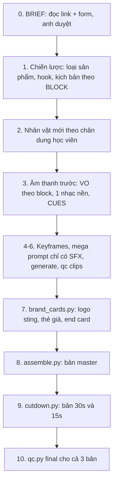

# Thiết kế: Muse-TS-ads — bộ skill làm video quảng cáo Thinking School

## 1. Mục tiêu
Một repo skill **riêng** (`thinkingschool-vn/Muse-TS-ads`) giúp Muse AI làm video quảng cáo cho các khoá học và chương trình của Thinking School:
- Dán link khoá học → ra **1 bản master** (1 tỷ lệ khung, 1 độ dài).
- Từ bản master, skill **tự cắt thêm bản 30s và 15s** cùng tỷ lệ.
- Có sẵn caption và headline để đăng.

Repo phim hoạt hình `Muse-animated-short-film` được giữ nguyên.

## 2. Các quyết định đã chốt
| Hạng mục | Quyết định |
|---|---|
| Repo | Repo GitHub mới, tách riêng |
| Nhân vật | Mỗi quảng cáo tạo nhân vật mới theo chân dung học viên mục tiêu |
| Định dạng | 9:16, 16:9, 1:1 × 15/30/60s |
| Đầu ra | 1 bản master/lần chạy, tự cắt 30s và 15s. Muốn tỷ lệ khác thì chạy lại từ đầu |
| Hình ảnh | Hoạt hình AI cho phần câu chuyện + motion graphics thương hiệu (logo thật, thẻ giá, QR Zalo, end card) |
| Brand kit | Lấy mặc định từ website, anh bổ sung sau |
| Đầu vào | Link khoá học + form điền các trường còn thiếu |

## 3. Kiến trúc (Phương án A — khuyến nghị)
Một `SKILL.md` điều phối toàn bộ quy trình, chi tiết từng bước nằm trong các module `references/`. Muse chỉ đọc module của bước đang làm, nên ngữ cảnh gọn.

Hai phương án đã loại:
- **B — chia thành nhiều skill nhỏ:** khó điều phối.
- **C — skill mỏng phụ thuộc repo phim:** dễ vỡ khi repo phim thay đổi.

## 4. Luồng làm việc


**Chi tiết các bước chính:**

- **Bước 0 — BRIEF.**
  - Muse đọc trang khoá học và điền `BRIEF.md`: tên, đối tượng, nỗi đau, lợi ích, giá gốc/giá ưu đãi, hạn ưu đãi, ngày khai giảng, link, CTA.
  - Trường nào chưa có thông tin thì ghi **⚠ cần xác nhận** và hỏi anh. Muse không tự bịa.

- **Bước 1 — Chiến lược.** Có 6 loại sản phẩm, mỗi loại có cấu trúc kịch bản riêng:
  1. Khoá lẻ
  2. Master Series
  3. Chương trình chuyên sâu (Mini MBA…)
  4. Seminar có ngày
  5. Miễn phí/phi lợi nhuận
  6. Membership/ưu đãi có hạn

  Thư viện hook lấy từ chính những nỗi đau trên website: "Học trước quên sau", "Bơi giữa biển thông tin", "Lịch trình kín"…

  Kịch bản chia thành các BLOCK có nhãn: `HOOK · VẤN ĐỀ · THƯƠNG HIỆU · LỢI ÍCH-1/2/3 · BẰNG CHỨNG · ƯU ĐÃI · CTA`. Câu VO của mỗi block phải **đứng độc lập được** — đây là điều kiện để cắt bản ngắn.

- **Bước 7 — `brand_cards.py` (mới).** Dùng ffmpeg render chữ, logo và giá nên luôn chính xác, không phụ thuộc AI. Gồm 3 loại thẻ:
  - `logo_sting` (1–1.5s)
  - `price_card` (2.5–3.5s): giá gốc gạch ngang, giá ưu đãi, hạn ưu đãi
  - `end_card` (4–5s): logo, CTA, link/QR, hotline

  Mỗi thẻ có layout riêng cho 9:16, 16:9 và 1:1.

- **Bước 8 — mở rộng `assemble.py`:**
  - Thêm tỷ lệ 1:1 và safe zone cho từng tỷ lệ.
  - Lấy font và màu từ `brand.json`.
  - Có tuỳ chọn logo nhỏ ở góc.
  - Gắn nhãn `block` cho scene, VO và overlay.

- **Bước 9 — `cutdown.py` (mới).** Đọc nhãn block trong bản dựng master:
  - **30s:** HOOK → THƯƠNG HIỆU → LỢI ÍCH-1 → ƯU ĐÃI → CTA.
  - **15s:** HOOK+THƯƠNG HIỆU (gộp) → CTA.

  Script xuất `edit_30.json` và `edit_15.json`, rồi gọi `assemble.py` để dựng. Cảnh báo nếu bản cắt lệch quá ±1.5s so với thời lượng đích.

- **Bước 10 — mở rộng `qc.py`.** Kiểm tra thêm:
  - Thời lượng đúng 15/30/60s.
  - End card có mặt trong 4 giây cuối.
  - Giá, ngày và link đọc trong VO khớp với BRIEF (kiểm bằng whisper).
  - Safe zone đúng theo từng tỷ lệ.

  Giữ nguyên các kiểm tra cũ: loudness -14 LUFS, chồng VO, jump cut, chữ lạ lọt vào hình.

## 5. Brand kit (`brand/`)
- **`brand.json`:**
  - Màu: #0064FF, #8B5CF6, #4F46E5, #F59E0B
  - Font, hotline 0909 00 64 09, email, link
- **Hình ảnh:** `logo-light.png`, `logo-dark.png`, `zalo-qr.png` (tải từ app.thinkingschool.vn/images/)
- **`LEXICON.md`:** cách đọc trong VO các tên Thinking School / Thinking Uni / Master Series / Mini MBA / AI / Zalo, và cách đọc số tiền.
- **`BRAND_GUIDE.md`:**
  - Giọng điệu thương hiệu.
  - Không dùng "nhất / số 1 / duy nhất" nếu không có bằng chứng.
  - Giá ưu đãi phải kèm hạn.
  - Mọi con số phải có nguồn ghi trong BRIEF.

## 6. Sản phẩm bàn giao mỗi lần chạy
- `ts-<slug>-<aspect>-60s.mp4`, `-30s.mp4`, `-15s.mp4`
- Báo cáo QC cho từng bản
- `BRIEF.md`
- `AD_COPY.md`: caption, headline, hashtag cho Facebook/TikTok/YouTube

## 7. Cấu trúc repo
```
Muse-TS-ads/
├─ SKILL.md            # điều phối
├─ README.md
├─ brand/              # brand.json, logo, QR, LEXICON, BRAND_GUIDE
├─ references/         # 00-brief … 10-lessons
├─ scripts/            # assemble.py, qc.py, brand_cards.py, cutdown.py
├─ templates/          # BRIEF.md, edit.example.json, AD_COPY.md
├─ tests/              # test cutdown + brand_cards
└─ examples/thinking-uni-launch/
```

## 8. Kiểm thử
- **Test tự động:** `cutdown.py` (chọn block, tính thời lượng) và `brand_cards.py` (render đủ 3 tỷ lệ, không lỗi font tiếng Việt).
- **Chạy thử toàn bộ quy trình bằng clip mẫu:**
  - Dựng bản master 9:16 60s → cắt 30s và 15s.
  - Render thẻ thương hiệu cho 1:1 và 16:9.
  - `qc.py` phải pass cho cả 3 bản.

## 9. Ngoài phạm vi
- Tự động đăng lên các nền tảng quảng cáo.
- Script scraper riêng (Muse tự đọc trang được).
- Quay màn hình hoặc dùng footage thật.

## 10. Rủi ro
> [!WARNING]
> `gh` chưa đăng nhập, nên trước khi push anh cần làm một trong hai cách:
> - tạo repo trống `thinkingschool-vn/Muse-TS-ads` trên web, hoặc
> - chạy `gh auth login`.

- **Số liệu trên website có thể thay đổi:** skill luôn đọc lại trang, không hard-code.
- **Bản cắt ngắn chỉ hoạt động khi kịch bản thật sự viết theo block:** SKILL.md bắt buộc điều này và `cutdown.py` sẽ báo lỗi nếu thiếu nhãn.
- **Logo trên web có thể độ phân giải thấp:** anh nên gửi file gốc (SVG/PNG lớn).
